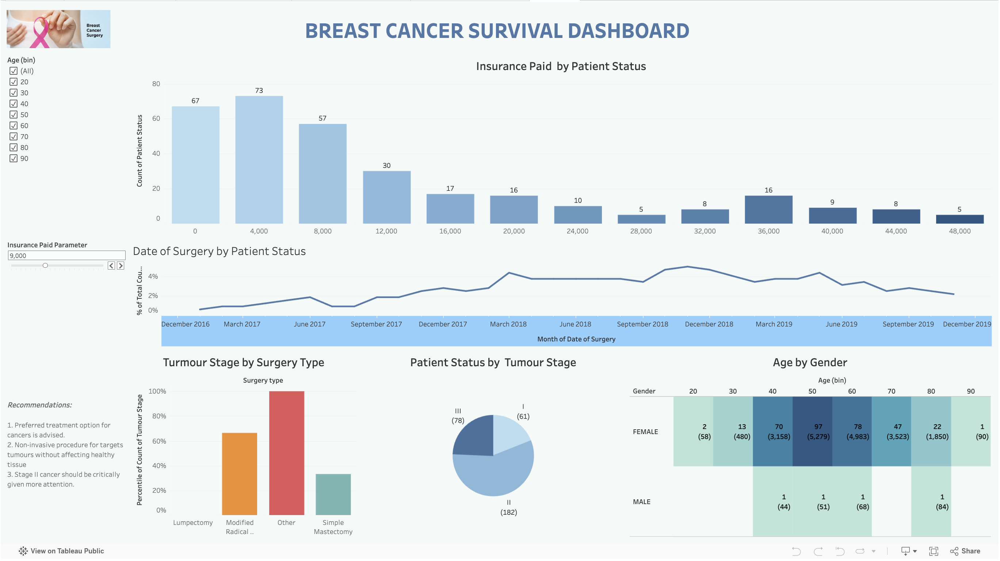

# 📊 Breast Cancer Survival Dashboard

An interactive Tableau dashboard analyzing breast cancer survival patterns, treatment distribution, and patient demographics to uncover meaningful healthcare insights.

---

## 🎯 Objective
To explore and analyze breast cancer patient data in order to identify survival trends based on tumour stage, treatment methods, and insurance coverage.

---

## 🚀 Live Dashboard
👉 [View on Tableau Public](https://public.tableau.com/app/profile/rachit.singh5076/viz/BREASTCANCERSURVIVALDASHBOARD_17773966228100/Dashboard1)

---

## 🖼️ Dashboard Preview


---

## 📌 Key Insights
- **Stage II and Stage III** have the highest number of patients, indicating mid-stage detection is most common  
- Survival outcomes show clear variation depending on **tumour stage progression**  
- **Surgery types** are unevenly distributed, suggesting differences in treatment strategies  
- A significant portion of patients rely on **insurance coverage**, highlighting its importance in treatment accessibility  
- The majority of cases fall within the **40–60 age group**, indicating higher risk in middle-aged individuals  

---

## 📊 Features
- Interactive filters for exploring patient data dynamically  
- Visual comparison of tumour stages and survival outcomes  
- Breakdown of treatment methods and their distribution  
- Clean and intuitive dashboard design for easy interpretation  

---

## 🛠️ Tools & Technologies
- **Tableau** – Data Visualization  
- **Microsoft Excel** – Data Preparation  
- **Git & GitHub** – Version Control and Project Hosting  

---

## 📂 Repository Structure
```
├── dashboard.twbx # Tableau packaged workbook
├── dataset.xlsx # Source dataset
├── preview.png # Dashboard screenshot
├── README.md # Project documentation
```


---

## 📈 Project Value
This project demonstrates:
- Strong data visualization and storytelling skills  
- Ability to extract actionable insights from healthcare data  
- Dashboard design focused on clarity and usability  

---

## 🚀 Future Improvements
- Integrate real-world healthcare datasets for deeper analysis  
- Add predictive modeling for survival rate estimation  
- Enhance dashboard interactivity with advanced filtering  

---

## 👨‍💻 Author
**Rachit Singh**
